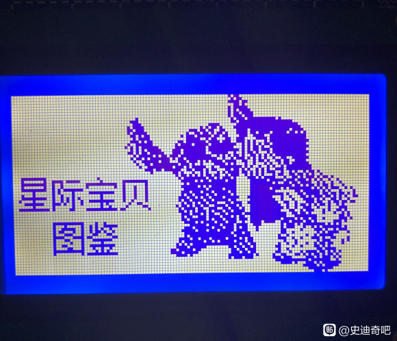
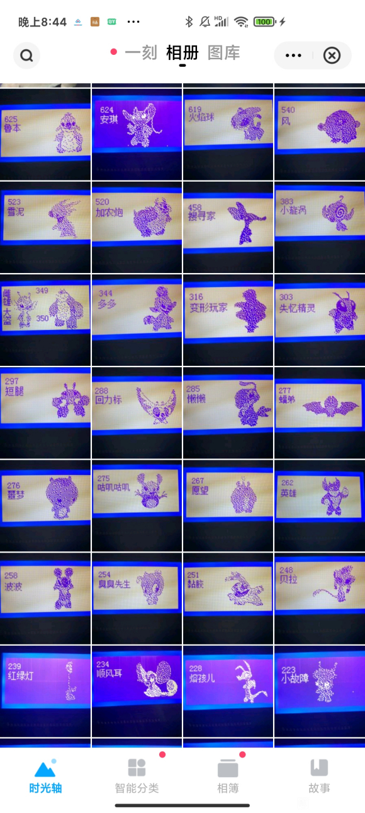

# Aloha
星际宝贝，用的51单片机实现按钮控制换图，当时把能搜到的星际宝贝图片都搜集了，完后做了这个电子相册，通过电子屏幕显示

## 实现图片
更多图片内容查看 ===>[https://tieba.baidu.com/p/7255841009?pid=138267306984&cid=0&red_tag=0171558352#138267306984] 
### 图片预览

  

  

## 如何使用
就 一个简单的51单片机程序做的一个电子相册，用eeprom做存储实现断电不丢失
完后用的12864做LCD显示屏

星际宝贝的所有的点图都是我已经用软件提取好了的
因为时间太久了很多细节的东西我也忘掉了
如果你想要clone这个项目 直接连接就行 看《星际宝贝》这个文件夹

记得当时还有两个按键控制上一张和下一张
都在那个文件夹里面
